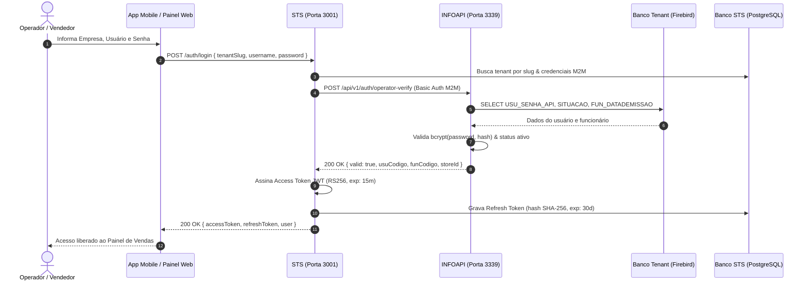
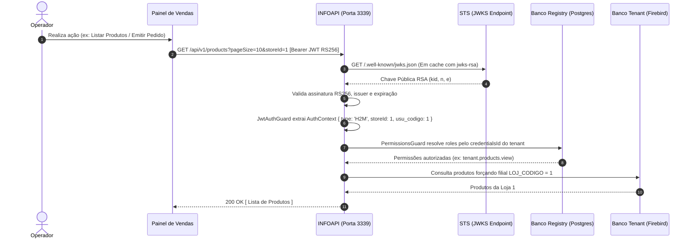
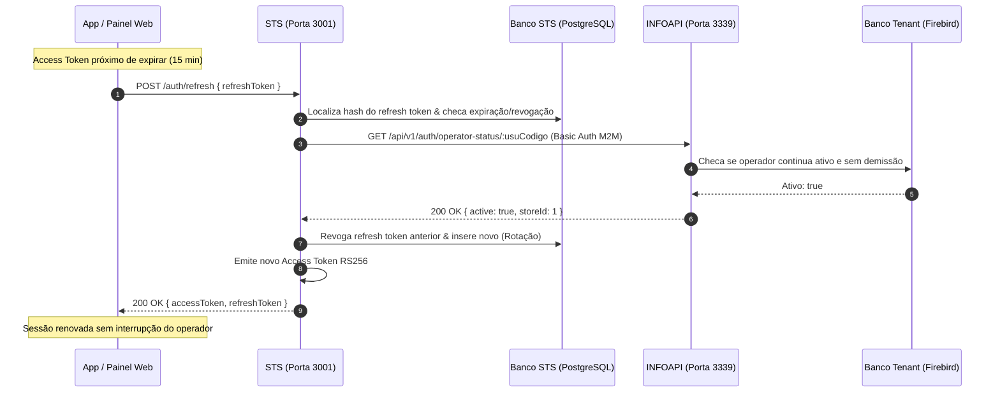

# Arquitetura de Autenticação H2M & Security Token Service (STS)

Este documento descreve a arquitetura de segurança, contratos de API e fluxos de dados para autenticação **H2M (Human-to-Machine)** entre os aplicativos clientes (Painel de Vendas / App Mobile), o **STS (`info-api-sts`)** e a **INFOAPI (`info-api`)**, preservando a interoperabilidade estrita com as integrações legadas **M2M (Machine-to-Machine)**.

---

## 1. Visão Geral e Princípios Arquiteturais

Historicamente, a INFOAPI utilizava autenticação simétrica **HS256** baseada em segredo compartilhado (`JWT_SECRET`) para integrações M2M de retaguarda. Para suportar operadores humanos em dispositivos móveis e terminais web de vendas, foi adotada a segregação de responsabilidades através de um **Security Token Service (STS)** dedicado com criptografia assimétrica **RS256**:

* **Zero Senhas Centrais**: As credenciais dos operadores (`USU_SENHA_API`) continuam armazenadas unicamente no banco de dados Firebird de cada tenant com hash `bcrypt`.
* **Criptografia Assimétrica (RS256)**: Apenas o STS detém a chave privada RSA (2048 bits) para assinar os tokens. As APIs de borda (INFOAPI) necessitam apenas da chave pública para validar as requisições.
* **Descoberta Dinâmica de Chaves (JWKS - RFC 7517)**: A INFOAPI consome as chaves públicas do STS via `GET /.well-known/jwks.json` com cache automático e rate-limiting, permitindo rotação de chaves (*key rollover*) sem downtime nem redistribuição manual de segredos.
* **Isolamento de Filial (Multi-Store Enforcement)**: O token H2M embute autoritariamente a loja de lotação (`storeId`) e os identificadores do operador (`usu_codigo`, `fun_codigo`). O backend rejeita ou sobrescreve silenciosamente tentativas de manipular a loja via query ou body.

---

## 2. Diagramas de Sequência (Mermaid)

### 2.1. Fluxo de Login do Operador (H2M)



---

### 2.2. Fluxo de Consumo de Recursos e Autorização RBAC



---

### 2.3. Fluxo de Renovação de Sessão (Silent Refresh)



---

## 3. Especificação das Claims do Token JWT (RS256)

### Cabeçalho (Header)
```json
{
  "alg": "RS256",
  "typ": "JWT",
  "kid": "infovendas-sts-key-1"
}
```

### Carga Útil (Payload)
```json
{
  "sub": "1",
  "credentialsId": "5349092f-2a78-4fbc-82d6-6eafc69b9fa8",
  "storeId": 1,
  "usu_codigo": 1,
  "fun_codigo": 1,
  "type": "H2M",
  "iss": "infovendas-sts",
  "iat": 1789760323,
  "exp": 1789761223
}
```

### Descrição dos Campos

| Campo | Tipo | Descrição |
| :--- | :--- | :--- |
| `sub` | `string` | Identificador do sujeito. No fluxo H2M, corresponde ao código do operador (`usu_codigo`). |
| `credentialsId` | `string` (UUID) | Identificador da conta do tenant no banco Registry da INFOAPI. Utilizado para resolução RBAC. |
| `storeId` | `number` | Código da filial à qual o operador está vinculado. Utilizado autoritariamente na INFOAPI. |
| `usu_codigo` | `number` | Código numérico do operador no Firebird. Gravado obrigatoriamente no pedido. |
| `fun_codigo` | `number` | Código do funcionário vinculado no Firebird. Gravado no pedido. |
| `type` | `string` | `'H2M'` para operadores humanos autenticados via STS; `'M2M'` para integrações legadas de sistema. |
| `iss` | `string` | Emissor do token (`infovendas-sts`). Validado obrigatoriamente pela `JwtH2mStrategy`. |

---

## 4. Matriz de Endpoints das APIs

### 4.1. STS (`info-api-sts` - Porta 3001)

| Método | Endpoint | Descrição | Autenticação |
| :--- | :--- | :--- | :--- |
| `POST` | `/auth/login` | Autentica operador no Firebird e emite par RS256 + Refresh Token | Pública |
| `POST` | `/auth/refresh` | Rotação de refresh token com revalidação de status do operador | Pública (Refresh Token) |
| `POST` | `/auth/logout` | Revoga o refresh token no banco PostgreSQL | Pública (Refresh Token) |
| `GET` | `/.well-known/jwks.json` | Exposição das chaves públicas RSA (RFC 7517) | Pública |
| `GET` | `/docs` | Documentação interativa Swagger UI | Pública |

### 4.2. INFOAPI (`info-api` - Gateway Porta 3339)

| Método | Endpoint | Descrição | Guarda / Estratégia |
| :--- | :--- | :--- | :--- |
| `POST` | `/api/v1/auth/operator-verify` | Validação de credenciais do operador na base Firebird | `TenantAuthGuard` (M2M) |
| `GET` | `/api/v1/auth/operator-status/:usuCodigo` | Checagem de operador ativo e sem rescisão | `TenantAuthGuard` (M2M) |
| `GET` | `/api/v1/products` | Lista produtos paginados forçando a filial do operador se H2M | `JwtAuthGuard` + `PermissionsGuard` |
| `GET` | `/api/v1/clients` | Lista clientes paginados da filial/tenant | `JwtAuthGuard` + `PermissionsGuard` |
| `POST` | `/api/v1/orders` | Emite pedido atribuindo autoritariamente o operador do token | `JwtAuthGuard` + `PermissionsGuard` |
| `GET` | `/api/v1/orders` | Lista histórico de pedidos da loja do operador | `JwtAuthGuard` + `PermissionsGuard` |

---

## 5. Guia de Integração para Clientes Frontend & Mobile

### 5.1. Inicialização do Cliente HTTP com Interceptor

```typescript
// Exemplo em TypeScript / JavaScript com Fetch API ou Axios
class ApiClient {
  private accessToken: string | null = null;
  private refreshToken: string | null = null;
  private readonly stsBaseUrl = 'http://localhost:3001';
  private readonly apiBaseUrl = 'http://localhost:3339/api/v1';

  async login(tenantSlug: string, username: string, password: string) {
    const res = await fetch(`${this.stsBaseUrl}/auth/login`, {
      method: 'POST',
      headers: { 'Content-Type': 'application/json' },
      body: JSON.stringify({ tenantSlug, username, password }),
    });

    if (!res.ok) throw new Error('Falha no login');
    const data = await res.json();
    this.accessToken = data.accessToken;
    this.refreshToken = data.refreshToken;
    return data.user;
  }

  async request(endpoint: string, options: RequestInit = {}) {
    let res = await fetch(`${this.apiBaseUrl}${endpoint}`, {
      ...options,
      headers: {
        ...options.headers,
        Authorization: `Bearer ${this.accessToken}`,
      },
    });

    // Se o token expirou (401), tenta renovar automaticamente
    if (res.status === 401 && this.refreshToken) {
      const refreshed = await this.refreshSession();
      if (refreshed) {
        // Re-executa a requisição original com o novo token
        res = await fetch(`${this.apiBaseUrl}${endpoint}`, {
          ...options,
          headers: {
            ...options.headers,
            Authorization: `Bearer ${this.accessToken}`,
          },
        });
      }
    }

    return res;
  }

  private async refreshSession(): Promise<boolean> {
    try {
      const res = await fetch(`${this.stsBaseUrl}/auth/refresh`, {
        method: 'POST',
        headers: { 'Content-Type': 'application/json' },
        body: JSON.stringify({ refreshToken: this.refreshToken }),
      });

      if (!res.ok) return false;
      const data = await res.json();
      this.accessToken = data.accessToken;
      this.refreshToken = data.refreshToken;
      return true;
    } catch {
      return false;
    }
  }
}
```

---

## 6. Segurança e Conformidade

1. **Prevenção contra *Algorithm Confusion***:
   * A `JwtStrategy` (M2M) está fixada estritamente em `algorithms: ['HS256']`.
   * A `JwtH2mStrategy` (H2M) está fixada estritamente em `algorithms: ['RS256']`.
   * Um atacante não consegue forjar um token RS256 assinado com a chave secreta HMAC ou vice-versa.
2. **Mitigação de BOLA (Broken Object Level Authorization)**:
   * O frontend não tem autoridade para forjar `store_id`, `user_id` ou `employee_id` em pedidos. Os valores são extraídos criptograficamente das claims do JWT validado.
3. **Isolamento de Chaves Privadas**:
   * A chave privada RSA fica armazenada de forma restrita no ambiente do STS. Nem a INFOAPI nem os bancos dos clientes têm acesso à chave privada.
