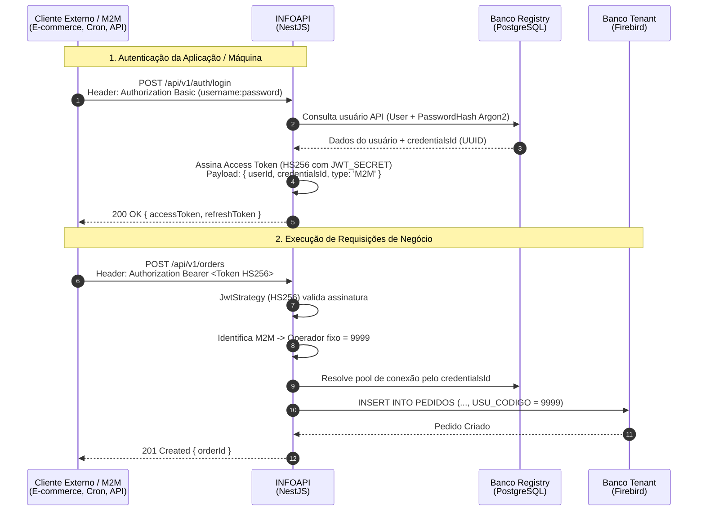
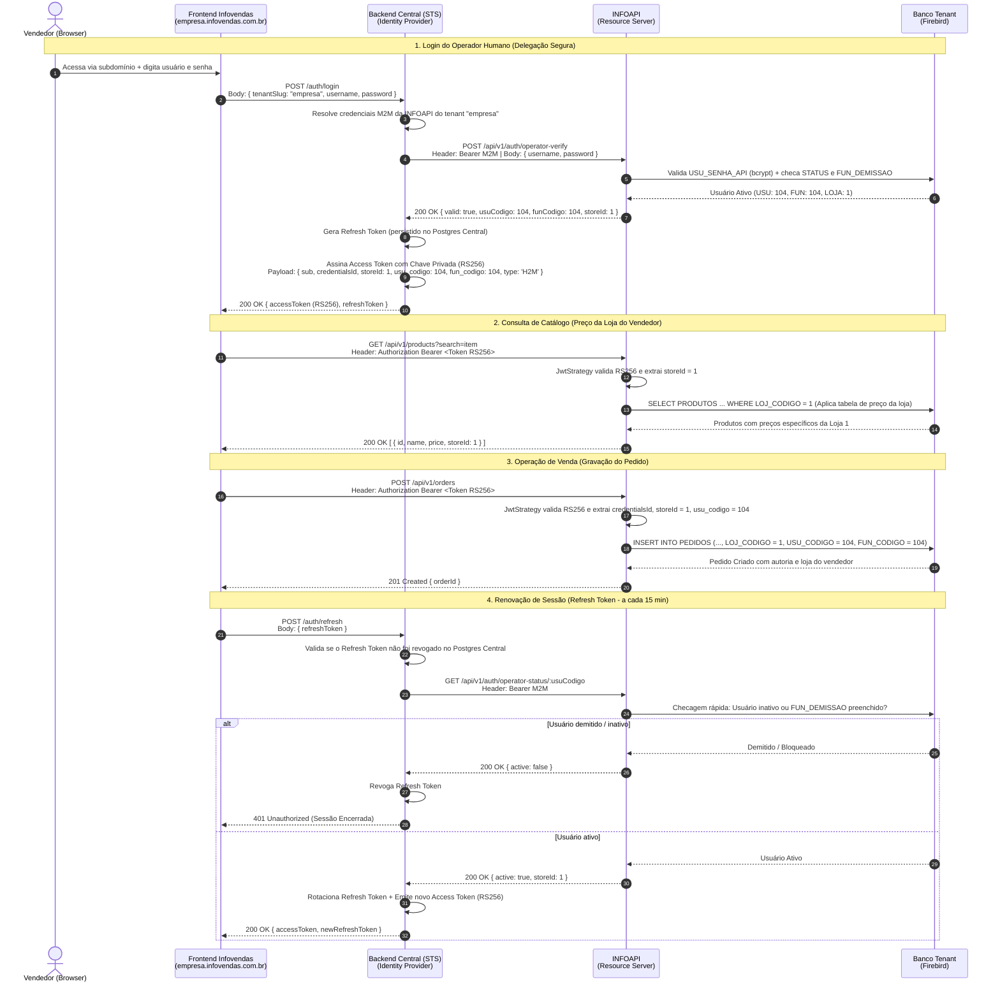

# Workflows de Autenticação e Integração: M2M vs. H2M

Este documento detalha os dois fluxos de integração suportados pela **INFOAPI**:
1. **Workflow M2M (Machine-to-Machine)**: Fluxo atual utilizado por integrações de sistemas externos (e-commerce, ERPs terceiros, bots).
2. **Workflow H2M (Human-to-Machine)**: Nova arquitetura para o Frontend Infovendas, com serviço central atuando como Identity Provider / STS (Security Token Service) desacoplado.

---

## 1. Workflow M2M (Machine-to-Machine - Atual)

### Características
* **Ator**: Sistema ou serviço externo automatizado.
* **Autenticação**: `Basic Auth` (usuário e senha de API registrados no Postgres Registry).
* **Criptografia do Token**: Simétrica (`HS256`) com segredo compartilhado (`JWT_SECRET`).
* **Operador no Firebird**: Usuário fixo de sistema/integração (`9999`).
* **Canal**: Direto entre o cliente e a INFOAPI.

### Diagrama de Sequência (M2M)

---

## 2. Workflow H2M (Human-to-Machine - Nova Arquitetura)

### Características
* **Ator**: Vendedor físico operando a interface web (Frontend Infovendas).
* **Resolução de Tenant**: Automática via subdomínio (`empresa.infovendas.com.br`).
* **Identity Provider / STS**: Backend Central gerencia as credenciais dos tenants e autentica o usuário humano contra o banco do cliente.
* **Criptografia do Token**: Assimétrica (`RS256`). O Backend Central assina com a **Chave Privada**; a INFOAPI valida com a **Chave Pública** (em memória, sem consultar banco).
* **Operador e Loja no Firebird**: Dinâmico, extraído diretamente das claims do JWT (`usu_codigo`, `fun_codigo`, `storeId`/`LOJ_CODIGO`). O `storeId` amarra a tabela de preços do vendedor na consulta de produtos e a loja física de emissão no pedido.
* **Ciclo de Vida & Revogação**: Access Token stateless de curta duração (15 min) + Refresh Token revogável com validação de status ativo e data de demissão (`FUN_DEMISSAO`) no banco do tenant a cada renovação.
* **Fluxo de Negócio**: **Direto** do Frontend para a INFOAPI (sem proxy de dados ou gargalo no Backend Central).

### Diagrama de Sequência (H2M)

---

## 3. Matriz Comparativa de Arquitetura

| Dimensão | Workflow M2M (Atual) | Workflow H2M (Novo) |
| :--- | :--- | :--- |
| **Origem da Requisição** | Servidores externos / Backends | Navegador do Vendedor (SPA) |
| **Ponto de Autenticação** | `POST /api/v1/auth/login` (INFOAPI) | `POST /auth/login` (Backend Central STS) |
| **Algoritmo do JWT** | `HS256` (Segredo simétrico) | `RS256` (Par de chaves pública / privada) |
| **Validação na INFOAPI** | Segredo local `JWT_SECRET` | Chave Pública (`PUBLIC_KEY` / JWKS) |
| **Identificação do Operador** | Fixo de integração (`9999`) | Dinâmico via claims (`usu_codigo`, `fun_codigo`) |
| **Resolução de Loja / Preço** | Fixo no cadastro da API ou query param | Injetado via claim `storeId` (tabela de preço da loja) |
| **Multitenancy** | `credentialsId` atrelado ao `User` da API | `credentialsId` emitido no token após lookup do subdomínio |
| **Tráfego de Negócio (`/orders`)** | Direto na INFOAPI | **Direto na INFOAPI** (sem intermediário) |
| **Revogação de Sessão** | Via expiração do JWT | Imediata no refresh através de checagem no Firebird |
