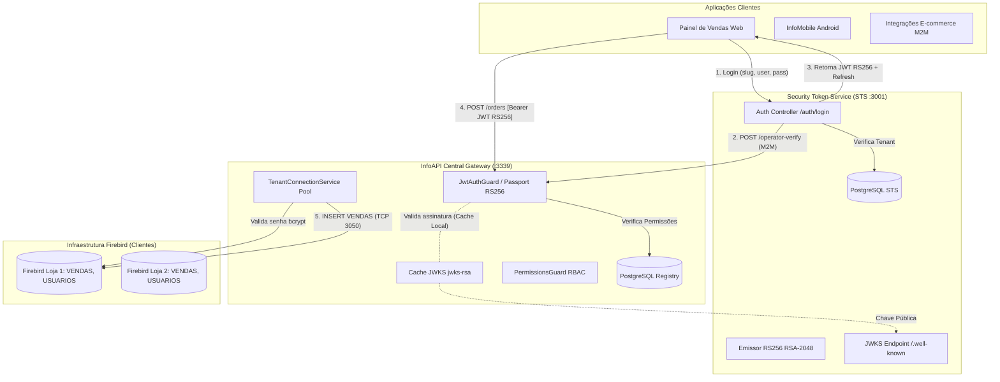
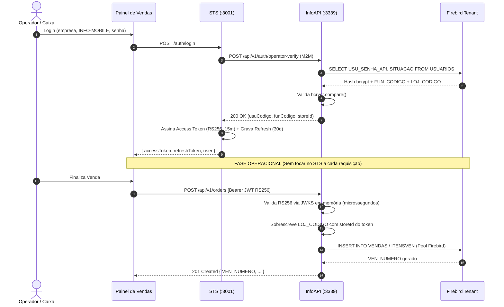

# Arquitetura de Autenticação STS & InfoAPI Central (Documento Executivo)

Documento técnico elaborado para alinhamento e apresentação aos engenheiros seniores e veteranos da Infobrasil Sistemas, detalhando os princípios de separação de responsabilidades, criptografia assimétrica RS256, Dual-Auth (M2M/H2M) e conexão dinâmica com bancos Firebird.

---

## 1. Sumário Executivo

A evolução da **InfoAPI** para suportar pontos de venda web (Painel de Vendas / PDV) e dispositivos móveis (InfoMobile) exigiu a superação do modelo legado puramente M2M baseado em chave simétrica `HS256` compartilhada. 

A arquitetura adotada introduz o **Security Token Service (STS)** desacoplado com chaves assimétricas **RS256** e discovery via **JWKS (RFC 7517)**, preservando:
1. **Zero Senhas Centrais**: As credenciais dos operadores continuam residindo unicamente no banco de dados Firebird de cada cliente sob hash `bcrypt` (`USU_SENHA_API`).
2. **Alta Disponibilidade e Resiliência**: O STS não está no caminho crítico de processamento de vendas. A InfoAPI valida tokens de operadores em memória através da chave pública em cache, permitindo que as lojas vendam mesmo durante eventuais oscilações ou manutenções no STS.
3. **Stateless Connection Routing**: O JWT assinado carrega o `credentialsId` do tenant, permitindo alocação imediata de conexões no pool Firebird sem round-trips adicionais de I/O em bancos centrais.
4. **Isolamento Estrito de Filial**: O token H2M embute autoritariamente a filial de lotação (`storeId`) e identificadores do operador (`USU_CODIGO`, `FUN_CODIGO`), impedindo manipulações indevidas a partir do cliente.

---

## 2. Diagramas de Arquitetura

### 2.1. Topologia de Componentes

### 2.2. Diagrama de Sequência de uma Venda

---

## 3. Justificativas das 6 Decisões Técnicas

| Decisão | O que é | Por que foi escolhido (Justificativa) |
| :--- | :--- | :--- |
| **1. Criptografia Assimétrica RS256** | Chave privada no STS e chave pública na InfoAPI | Elimina o risco de falsificação de tokens caso a API de borda seja comprometida (princípio do menor privilégio). |
| **2. Zero Senhas Centrais** | Senhas residem no Firebird com `bcrypt` | Respeita a soberania de dados do cliente e as alterações cadastrais feitas diretamente no ERP Desktop. |
| **3. Roteamento via `credentialsId`** | ID do pool de conexão embutido no JWT | Permite à InfoAPI obter conexões direto da memória RAM, eliminando queries ao PostgreSQL para cada requisição. |
| **4. Dual-Auth (M2M vs. H2M)** | M2M para robôs; H2M para operadores humanos | M2M atende retaguarda e integrações; H2M fixa operador, vendedor e loja, garantindo auditoria e conformidade fiscal. |
| **5. Desacoplamento do STS** | STS separado da InfoAPI | Vendas em andamento não sofrem impacto se o STS reiniciar; InfoAPI escala sem sobrecarga de emissão de tokens. |
| **6. Padrão UPPERCASE Direto** | Sem normalização em memória no Node.js | Mantém fidelidade às convenções corporativas dos bancos Firebird, economiza CPU e evita duplicação de payload. |

---

## 4. FAQ para a Revisão com o Veterano

1. **"Se o STS ficar fora do ar por 5 minutos, os caixas param de vender?"**  
   *Não.* O token JWT tem validade de 15 minutos e a validação na InfoAPI utiliza a chave pública mantida em cache de memória (`jwks-rsa`). Os caixas continuarão transacionando normalmente.

2. **"Um operador do caixa pode adulterar o `credentialsId` ou `storeId` no token para ver outra filial?"**  
   *Não.* O payload do token é protegido pela assinatura matemática RSA-2048. Se qualquer claim for alterada no cliente, a assinatura é rejeitada na hora com `401 Unauthorized`.

3. **"O Firebird não vai abrir conexões demais com múltiplos caixas web simultâneos?"**  
   *Não.* O `TenantConnectionService` implementa pool com limite por tenant, liberação estrita em `try/finally` e keepalive TCP configurado no kernel Linux (`tcp_keepalive_time=60`), evitando vazamento de conexões e locks órfãos.

---

## 5. Artefatos Gerados

- **PDF Executivo**: [`docs/arquitetura_infoapi_sts_veterano.pdf`](file:///c:/dev/info-api/docs/arquitetura_infoapi_sts_veterano.pdf) (802 KB, 4 páginas com capa, diagramas vetoriais SVG e formatação A4 para impressão/apresentação).
- **Script de Compilação**: [`scripts/generate-architecture-pdf.mjs`](file:///c:/dev/info-api/scripts/generate-architecture-pdf.mjs).
