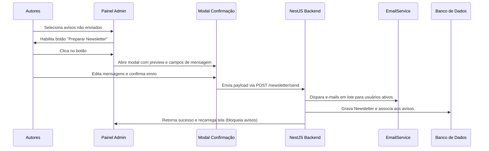

# Plano de Implementação: Módulo de Newsletter & Ajustes Administrativos

Este documento descreve a arquitetura, o fluxo de dados e os passos necessários para implementar o **Módulo de Newsletter** e permitir a edição de e-mails de usuários no painel de administração da InfoAPI.

---

## 1. Ajustes no Cadastro de Usuários (Painel Admin)

### 1.1. Diagnóstico do Problema de Carregamento
Atualmente, a edição de usuários não carrega ou exibe o e-mail cadastrado e o plano atual no modal. Isso ocorre porque o método `findOne` da classe `UserService` não seleciona as colunas `email` e `planId` no retorno do Prisma:
* **Arquivo:** [user.service.ts](file:///c:/dev/infoapi/src/modules/user/user.service.ts)
* **Solução:** Adicionar `email` e `planId` ao bloco `select` de `findOne(id)`.

### 1.2. Habilitação de Edição de E-mail
* **Arquivo:** [admin-components.js](file:///c:/dev/infoapi/src/modules/integration-request/templates/assets/admin-components.js)
* **Mudança:** Exibir o campo de e-mail no formulário do modal de usuários sempre (removendo a condicional `!id`). O e-mail será preenchido e editável em ambas as operações (criação e edição).
* **Segurança:** O DTO de atualização (`UpdateUserDto`) já é parcial e herda o campo de e-mail de forma opcional e válida, portanto o backend já está preparado para salvar essa alteração.

---

## 2. Módulo de Newsletter: Arquitetura & Banco de Dados

### 2.1. Modelagem do Banco (Prisma Schema)
Adicionaremos uma tabela de histórico de Newsletters e relacionaremos cada anúncio ao e-mail enviado:

```prisma
model Newsletter {
  id             Int            @id @default(autoincrement())
  subject        String         @db.VarChar(255)
  initialMessage String?        @map("initial_message") @db.Text
  finalMessage   String?        @map("final_message") @db.Text
  sentAt         DateTime       @default(now()) @map("sent_at")
  announcements  Announcement[]

  @@map("newsletters")
}
```

E no modelo `Announcement`:
```prisma
  newsletterId Int?            @map("newsletter_id")
  newsletter   Newsletter?     @relation(fields: [newsletterId], references: [id], onDelete: SetNull)
```

> [!NOTE]
> Usaremos o `npx prisma migrate dev` para aplicar as alterações e gerar o cliente atualizado automaticamente.

---

## 3. Fluxo Front-end & Interações no Painel



### 3.1. Interface de Avisos (Admin)
1. **Checkboxes na Tabela:**
   - Adicionamos uma coluna de seleção na tabela de Avisos.
   - Avisos que possuem `newsletterId` não nulo exibirão um badge discreto como `News #ID` no lugar da caixa de seleção, impedindo o envio duplo.
2. **Botão de Ação:**
   - Adicionamos o botão `<button id="btn-prep-newsletter" class="btn btn-primary hidden" onclick="UI.openNewsletterModal()">Preparar para Newsletter</button>` logo acima da tabela. Ele é exibido/habilitado quando um ou mais avisos válidos são selecionados.
3. **Modal de Confirmação:**
   - Contém:
     - Título: **InfoAPI News # [Próximo ID do Banco]**
     - Input de Assunto: pré-preenchido com `InfoAPI News #[Próximo ID] - Novidades e Atualizações`
     - Textarea de Mensagem Inicial (Rich ou Text)
     - Lista dos Avisos Selecionados
     - Textarea de Mensagem Final
     - Botão: `Enviar Newsletter para todos os clientes ativos`

---

## 4. Layout e Design do E-mail (InfoAPI News)

Para encantar os clientes, usaremos um design moderno de **glassmorphism/sleek dark-mode accent** no e-mail HTML:

* **Header:**
  - Imagem do logo da InfoAPI codificada em Base64 inline (lida diretamente de `logo-infoapi-black.png` no backend).
  - Badge com a versão atual da API (lida do `package.json`).
* **Corpo:**
  - Saudação personalizada (Ex: `Olá, {username}!`).
  - Pequeno parágrafo padrão ou mensagem inicial personalizada.
  - Cartões dos avisos renderizados de acordo com o tipo:
    - `INFO`: Card verde suave.
    - `WARNING`: Card amarelo com bordas douradas.
    - `ALERT`: Card vermelho com indicador de urgência.
    - `DOC`: Card azul/indigo corporativo com atalho para documentação.
* **Footer:**
  - Rodapé corporativo com redes, link do site e política de privacidade.

---

## 5. Questões e Dúvidas para o Usuário

> [!IMPORTANT]
> Por favor, confirme as seguintes definições antes de iniciarmos a codificação:

1. **Destinatários:**
   A Newsletter deve ser enviada para todos os usuários com `status: true` e `email` preenchido? Ou há algum papel/role específico que deve receber (ex: apenas parceiros e clientes)?
2. **Valores Padrão do E-mail:**
   Podemos utilizar os textos padrão abaixo ou deseja alguma alteração?
   * *Mensagem Inicial Padrão:* `Olá! Temos o prazer de compartilhar com você as últimas atualizações de recursos, novidades e alertas importantes do ecossistema InfoAPI.`
   * *Mensagem Final Padrão:* `Para dúvidas ou suporte com essas novidades, nossa equipe técnica está sempre disponível através do e-mail suporte@infobrasilsistemas.com.br ou pelo nosso suporte oficial.`
3. **Contador Autoincrementado (#ID):**
   Como exibiremos a versão "Preview/Preparação" antes do envio real, calcularemos o próximo ID buscando o último ID inserido mais um (ou exibindo `Novos Avisos` caso a tabela de newsletters esteja limpa). Está de acordo com esse comportamento?
4. **Controle de Permissões:**
   Deseja criar uma nova permissão como `core.newsletter.send` ou podemos atrelar ao escopo de anúncios (`core.announcement.create` / `core.announcement.update`) já existentes?
