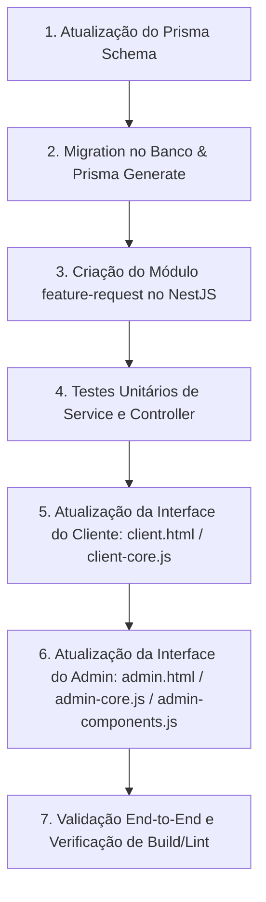

# Plano de Implementação: Solicitações de Funcionalidades (Feature Request)

Este documento descreve a especificação técnica, modelagem de banco de dados, fluxo de notificações por e-mail e as alterações de interface para a criação da aba de solicitações internas de funcionalidades tanto no painel do cliente quanto no painel administrativo da InfoAPI.

---

## 1. Visão Geral e Arquitetura

O objetivo é disponibilizar um canal direto e estruturado para os clientes solicitarem melhorias e novas funcionalidades no sistema, com ciclo de vida de resposta e avisos automatizados por e-mail:
1. **Cliente:** Submete uma solicitação textual no painel do cliente (`client.html`) e acompanha o status (Pendente / Respondida) e a resposta da equipe.
2. **Admin:** No painel administrativo (`admin.html`), a aba existente "Solicitações" passa a ser dividida em duas sub-abas:
   - **Acessos:** O fluxo existente de solicitações de integração/credenciais (`IntegrationRequest`).
   - **Funcionalidades:** Nova sub-aba para visualização e resposta às solicitações de features (`FeatureRequest`).
3. **Notificações por E-mail (Gmail API / EmailService):**
   - **Na abertura da solicitação:** Disparo imediato para a equipe (`SUPPORT_EMAIL`) com dados do cliente e o texto do pedido.
   - **Na resposta do admin:** Disparo imediato para o e-mail cadastrado do cliente com a resposta e o histórico do pedido.

---

## 2. Modelagem de Dados (Prisma ORM)

Seguindo a **Abordagem B (Bounded Context Dedicado)**, criaremos uma tabela isolada no PostgreSQL via Prisma para não poluir o domínio de infraestrutura/conexão de `integration_requests`.

### 2.1. Alterações no `prisma/schema.prisma`

```prisma
model FeatureRequest {
  id           String    @id @default(uuid())
  userId       String    @map("user_id")
  requestText  String    @map("request_text") @db.Text
  responseText String?   @map("response_text") @db.Text
  status       String    @default("PENDING") @db.VarChar(20) // "PENDING" | "ANSWERED"
  createdAt    DateTime  @default(now()) @map("created_at")
  updatedAt    DateTime  @updatedAt @map("updated_at")
  answeredAt   DateTime? @map("answered_at")

  user         User      @relation(fields: [userId], references: [id], onDelete: Cascade)

  @@index([userId])
  @@index([status])
  @@index([createdAt])
  @@map("feature_requests")
}
```

E no modelo `User`:
```prisma
model User {
  // ... campos existentes
  featureRequests FeatureRequest[]
  // ...
}
```

### 2.2. Migração do Banco
Executar:
```bash
npx prisma migrate dev --name add_feature_requests
```

---

## 3. Backend: Módulo `FeatureRequestModule`

Criaremos o módulo desacoplado em `src/modules/feature-request/`:

### 3.1. Estrutura de Arquivos
- `dto/create-feature-request.dto.ts` (validação com class-validator/Zod: `requestText` obrigatório, mínimo de 10 caracteres)
- `dto/respond-feature-request.dto.ts` (`responseText` obrigatório, não vazio)
- `feature-request.service.ts`
- `feature-request.controller.ts`
- `feature-request.module.ts`
- `feature-request.service.spec.ts` (testes unitários com mocks de Prisma e EmailService)

### 3.2. Endpoints e Segurança

| Método | Endpoint | Proteção | Descrição |
| :--- | :--- | :--- | :--- |
| `POST` | `/api/v1/feature-requests` | `JwtAuthGuard` | Cliente cria solicitação. `userId` obtido do token (`@CurrentUser().sub`). |
| `GET` | `/api/v1/feature-requests/my` | `JwtAuthGuard` | Cliente consulta seu próprio histórico de solicitações. |
| `GET` | `/api/v1/feature-requests` | `JwtAuthGuard`, `PermissionsGuard` (`integration-request.view`) | Admin lista todas as solicitações com suporte a filtro por status. |
| `PATCH` | `/api/v1/feature-requests/:id/respond` | `JwtAuthGuard`, `PermissionsGuard` (`integration-request.approve`) | Admin responde solicitação, alterando status para `ANSWERED`. |

### 3.3. Integração de E-mails com `EmailService`
- **Ao criar:**
  - Persiste no banco.
  - Carrega dados do cliente (`user.user`, `user.email`).
  - Dispara `EmailService.sendToSupport(...)` com assunto `[InfoAPI] Nova Solicitação de Funcionalidade - {user}` e corpo HTML detalhado.
  - Tratamento com `try/catch` e log seguro: falhas no envio de e-mail não abortam o commit no banco nem quebram a requisição do usuário.
- **Ao responder:**
  - Atualiza registro: `responseText = dto.responseText`, `status = 'ANSWERED'`, `answeredAt = new Date()`.
  - Se o cliente tiver `user.email` cadastrado, dispara `EmailService.sendEmail(...)` contendo a resposta formal e citação da solicitação original.

---

## 4. Frontend: Painel do Cliente (`client.html` & `client-core.js`)

1. **Navegação:**
   - Adicionar o botão da aba no menu superior de abas:
     ```html
     <button class="tab-btn" onclick="UI.switchTab('requests')">Solicitações</button>
     ```
2. **Nova Seção (`#tab-requests`):**
   - **Formulário de Nova Solicitação:** Textarea estilizado, contador de caracteres e botão "Enviar Solicitação" com feedback visual de carregamento.
   - **Histórico do Cliente:** Lista/cards com status badge (`Pendente` em amarelo, `Respondida` em verde), data de envio, texto da solicitação e bloco destacado com a resposta da equipe da InfoBrasil.
3. **Lógica em `client-core.js`:**
   - Chamada à API `GET /api/v1/feature-requests/my` ao alternar para a aba.
   - Submissão via `POST /api/v1/feature-requests`.

---

## 5. Frontend: Painel Administrativo (`admin.html`, `admin-core.js`, `admin-components.js`)

1. **Sub-abas dentro da aba "Solicitações":**
   - Ao clicar na aba principal "Solicitações" (`#tab-requests`), o container renderizará um seletor de sub-abas:
     - `[ Acessos ]` (Ativo por padrão)
     - `[ Funcionalidades ]`
2. **Sub-aba "Acessos":**
   - Mantém o comportamento e componentes atuais: `Components.RequestFilterTabs(State.currentRequestFilter)` e a grid de solicitações de integração de lojas (`RequestCard`).
3. **Sub-aba "Funcionalidades":**
   - Exibe filtros de status (`TODAS`, `PENDENTES`, `RESPONDIDAS`).
   - Tabela/cards modernos listando:
     - Data e Hora
     - Cliente / Usuário
     - Texto da Solicitação
     - Status Badge
     - Ações: botão "Responder" (para solicitações pendentes) ou "Ver Resposta" (para já respondidas).
4. **Modal de Resposta Administrativa:**
   - Modal com o resumo da solicitação, informações do cliente solicitante, campo textarea para elaboração da resposta e botão "Enviar Resposta e Notificar Cliente".

---

## 6. Plano de Ação Passo a Passo



1. **Prisma:**
   - Adicionar `FeatureRequest` em `prisma/schema.prisma` e gerar cliente.
2. **Módulo Backend:**
   - Criar DTOs, Service com lógica de e-mail e Controller com RBAC.
   - Registrar `FeatureRequestModule` em `app.module.ts`.
   - Criar testes unitários `feature-request.service.spec.ts`.
3. **Painel do Cliente:**
   - Adicionar markup da aba no `client.html`.
   - Adicionar scripts de consulta e submissão em `client-core.js`.
4. **Painel do Admin:**
   - Atualizar `Components` e `UI.renderRequests()` em `admin-core.js` para suportar o chaveamento entre "Acessos" e "Funcionalidades".
   - Adicionar modal de resposta e integração com `PATCH /api/v1/feature-requests/:id/respond`.
5. **Garantia de Qualidade:**
   - Executar `npm run build`, `npm run lint` e testes unitários.
